# Project1. Java CRUD project with file I/O

#### 22000796 함상훈

-----------------
1. 설치한 IDE 및 실행 화면  
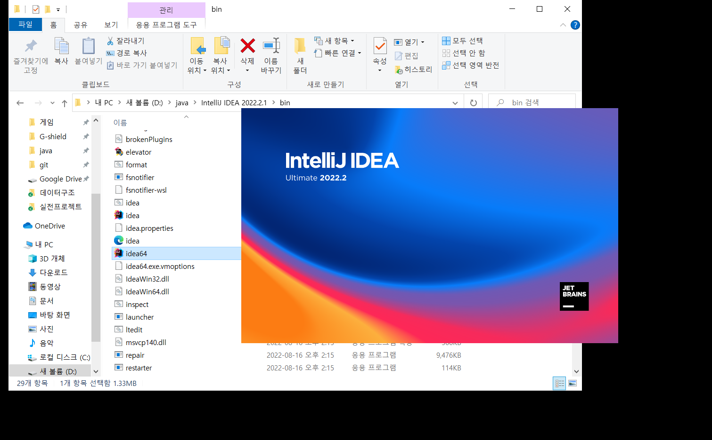
2. [1. 모든단어보기] 메뉴 실행 화면  
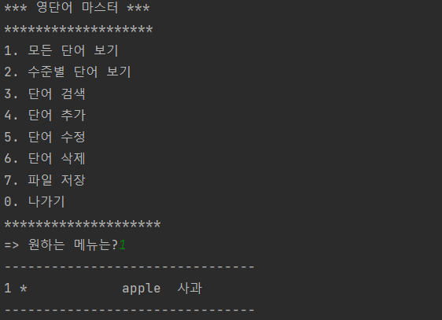
3. [4. 단어추가] 메뉴 실행 화면
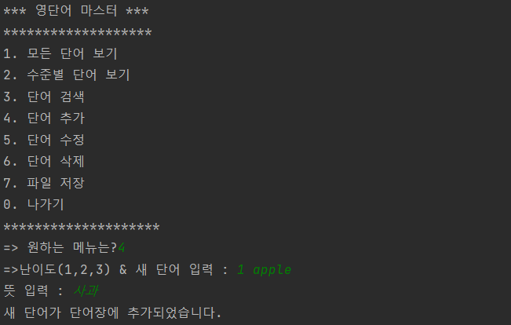  
4. [0. 나가기] 메뉴 실행 화면  

-------------------------------------------------  
1. 파일 단어 로딩 후 모든 단어 보기  
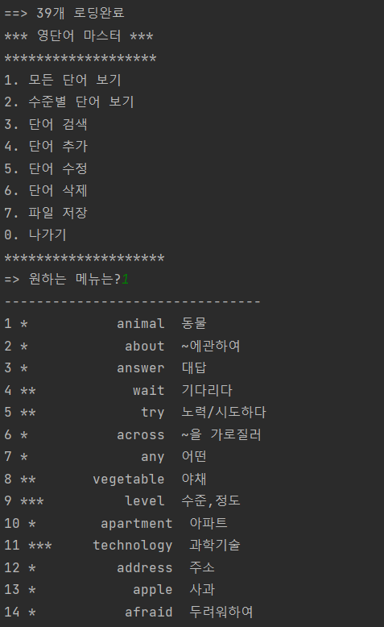
2. 수준별 단어보기  
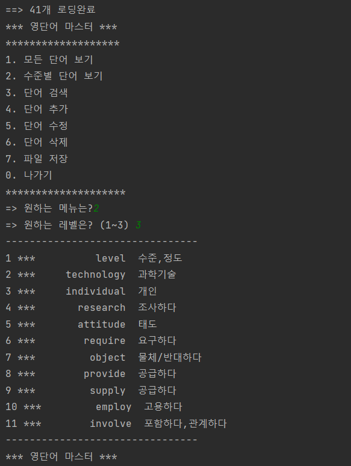
3. 단어검색  
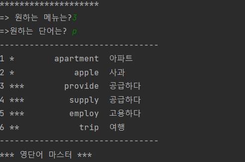
4. 단어수정  
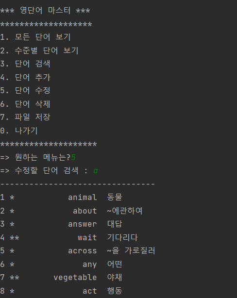
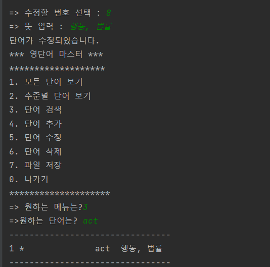
5. 단어삭제  
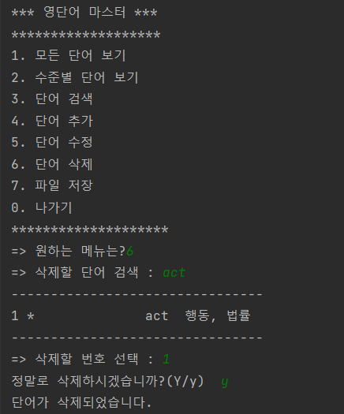
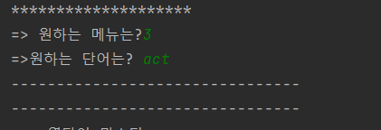
6. 파일저장  
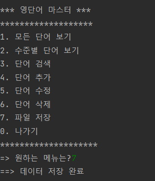
