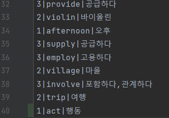

# Project1. Java CRUD project with file I/O

#### 22000796 함상훈

-----------------
1. 설치한 IDE 및 실행 화면  

2. [1. 모든단어보기] 메뉴 실행 화면  

3. [4. 단어추가] 메뉴 실행 화면  
  
4. [0. 나가기] 메뉴 실행 화면  

-------------------------------------------------  
### 1. 파일 단어 로딩 후 모든 단어 보기   
39개의 데이터를 파일에서 가져온 후 1번 메뉴를 실행한 결과이다.  

### 2. 수준별 단어보기  
2번 메뉴를 실행한 결과 3레벨의 단어들만 출력된 것을 확인할 수 있다.  

### 3. 단어검색  
문자를 입력받아 그 문자가 포함된 단어 모두 출력되는 것을 확인할 수 있다.  

### 4. 단어수정  
수정할 단어를 검색한 후 번호를 선택하고 의미를 수정할 수 있다. 잘 수정이 됐는지 3번 메뉴를 통해 확인했다.  

### 5. 단어삭제  
삭제할 단어를 검색한 후 번호를 선택하고 삭제할 수 있다. 잘 삭제가 됐는지 3번 메뉴를 통해 확인했다.  

### 6. 파일저장  
act라는 단어가 추가되어 파일에 저장되어 40번째에 추가된 것을 확인할 수 있다.(처음 프로그램 실행했을 떄 39개)  

